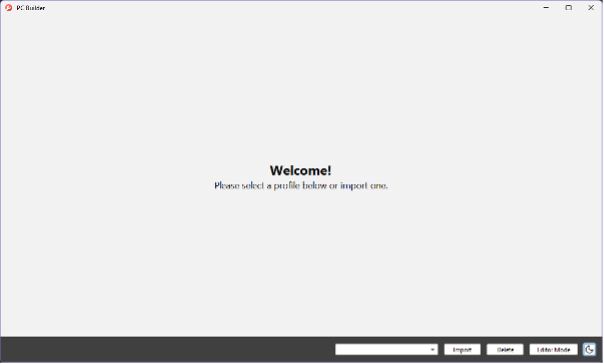
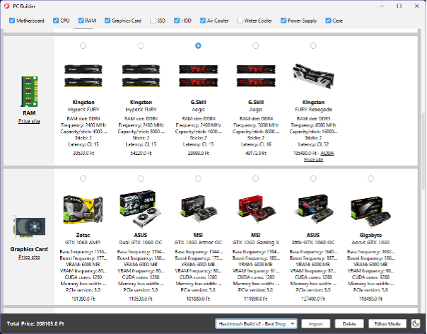
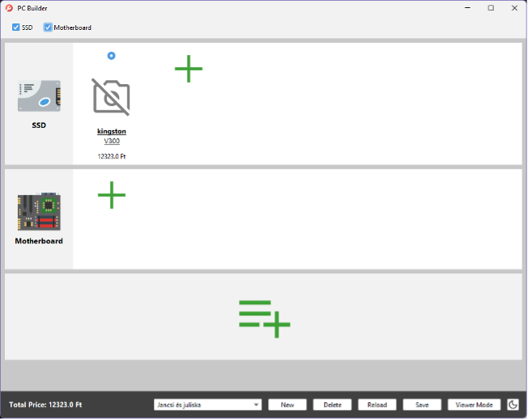
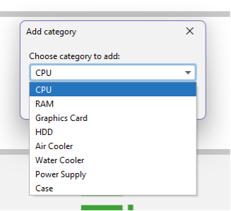
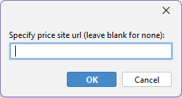
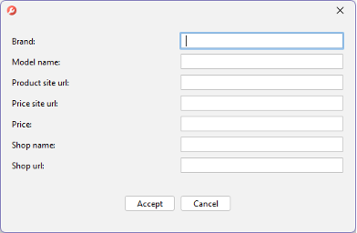
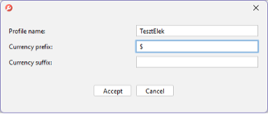

# PC Builder v2

Ez a projekt a [PC Builder](https://github.com/gabor7d2/PCBuilder) projektem továbbfejlesztése Programozás alapjai 3 háziként.

## A program célja
Asztali számítógépek összeépítése, a kívánt komponens kategóriákon (pl. CPU, alaplap, tápegység, SSD) belül kiválasztani a kívánt modellt (pl. i5-9600K, i7-9700K CPU, stb.) A komponenseknek a főbb jellemzőit és nagyítható képét megjeleníteni a felhasználói felületen, és jelezni azt is, ha valamely kiválasztott komponensek nem kompatibilisek egymással. Ezen kívül minden komponenshez biztosítani linkeket amik kattintásra elérhetők, az egyik link az árukereső vagy bolt oldalára mutat, a másik pedig a termék hivatalos weboldalára, ahol a specifikációja elérhető. Az egyik leglényegesebb funkciója pedig az, hogy összesíti a kiválasztott komponensek árát, és ezt élőben frissíti ahogy a felhasználó módosítja a kiválasztásait.

A program lényege, hogy ha valaki („vevő”, pl. egy ismerős) szeretne egy számítógépet, elmondja egy, a számítógépépítéshez értő embernek („eladó”) az igényeit (mit fog csinálni rajta, mennyi tárhely szükséges, milyen házat szeret stb.) és az eladó a PCBuilder segítségével egy „profil fájlt” összeállít azokból a komponensekből, amik körülbelül passzolnak a vevő igényeihez, majd ezt egy fájlba kiexportálja, és a programmal együtt megosztja a vevővel, aki ki tudja választani (esetleg egy kis segítségkéréssel), hogy mire mennyi pénzt kíván szánni, ahhoz, hogy a várt igényei teljesítve legyenek.

## A felhasználói felület
A program egy ablakból áll, amiben a komponens kategóriák külön sorban vannak, és kategóriákon (sorokon) belül maguk a komponensek, képpel, gyártóval, modellnévvel, komponenstől függő egyéb jellemzőkkel, és a komponens árával. A komponens képére kattintva megnyílik egy külön ablak, amiben a kép nagyobb felbontásban látható. Ezenkívül van egy-egy kattintható szöveg, az egyik megnyitja a gyártói oldalát a terméknek, a másik pedig az árukereső oldalt.

A fő ablak alján egy legördülő menüből lehet választani, melyik összeállított profilt szeretnénk használni, és vannak gombok amikkel lehet importálni és törölni profilt.

Ezenkívül egy gomb használatával be lehet lépni szerkesztés módba, ahol lehet szerkeszteni/törölni/hozzáadni kategóriákat, azon belül komponenseket, beleértve a jellemzőit, linkjeit, árát is. Szerkesztés módban el lehet menteni a profilt azonos névvel, mint amilyen nevűt megnyitottunk (felülírva azt), vagy új névvel is (mentés másként). Szerkesztés módból kilépve visszatérünk a normál felhasználói felületre.

### Üdvözlőképernyő

Az alábbi képernyő fogadja a felhasználót a program indításakor:

### Profil nézet

Itt az alkatrészek kategóriákba szedve jelennek meg. Az ablak tetején található sávban ki lehet választani, mely kategóriák látszódjanak. Az ablak alján látható a jelenleg kiválasztott komponensek végösszege. A „kikapcsolt” állapotban levő kategóriák nem számítanak bele a végösszegbe.

Az ablakban aláhúzott szöveggel vannak jelölve a weblinket tartalmazó szövegek, melyek kattintásra megnyitják az alapértelmezett böngészőben az adott linket.

A kategóriáknak elérhető az árukereső oldal linkje („price site”).

Az alkatrészeknek látható a gyártója, a modell neve, és egyéb, alkatrész-specifikus tulajdonságok.

Alul pedig látható az adott alkatrész ára, és a bolt neve és linkje, ahonnan az alkatrész ára származik. Ezenkívül egy árukereső oldal link is lehet itt („price site”), mely az árukereső oldalát nyitja meg az adott komponensnek.

### Profil importálása

Profilt importálni ZIP fájlból lehetséges, az „Import” gomb használatával, majd a megfelelő zip fájl kiválasztásával.

### Profil törlése

Profilt törölni a „Delete” gomb segítségével lehetséges, mely törlés előtt megkérdezi a felhasználót, hogy biztos-e benne, hogy törölni szeretné a profilt.

### Szerkesztő nézet

Az „Editor mode” gombbal át lehet váltani szerkesztő módba, ahol profilokhoz lehet új kategóriákat, alkatrészeket hozzáadni.

A legalsó sávban levő + gombbal lehet új kategóriát hozzáadni a profilhoz, a kategóriákon belül pedig a + gombbal új alkatrészt lehet hozzáadni.

Kategória hozzáadása:

Alkatrész hozzáadása:

Új profil létrehozása a „New” gombbal:

### Szerkesztő módban egyéb gombok

„Reload” gomb: újratölti a profilt lemezről. Ha ez egy profil, ami még nem volt elmentve, nem történik semmi.
„Save” gomb: lemezre menti a szerkesztő módban történt módosításokat.

Szerkesztő módban a fenti sávban a kategóriák pipálásával lehet kiválasztani, hogy a profil megnyitásakor mely kategóriák legyenek alapból bekapcsolva, és az alkatrészek kiválasztó gombjával pedig azt lehet kiválasztani, hogy profil megnyitáskor melyik alkatrész legyen alapértelmezetten kiválasztva.
